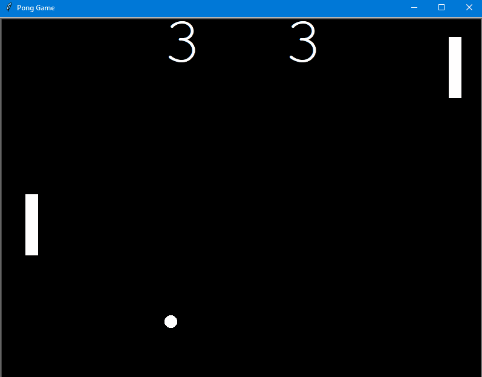

# SNAKE GAME

A classic Pong Game implementation in Python, developed during the course: *[100 Days of Code: The Complete Python Pro Bootcamp](https://www.udemy.com/course/100-days-of-code/?srsltid=AfmBOor9MN3qCpzSHSlwpW-iGIEaZoRj4bMQ1rHAaDoqW5OMJrucjWH5)*

## Activities

 - Set up the Main Screen
 - Create a Paddle that responds to Key Presses
 - Write the Paddle Clas and Create the Second Paddle
 - Write the Ball Class and Make the Ball Move
 - Add Ball Bouncing Logic
 - How to Detect Collisions with the Paddle
 - How to Detect when the Ball Goes out of Bounds
 - Score Keeping and Changing the Ball Speed

## Controls

    Left Paddle      | Right Paddle
    -----------------|---------------
    w - Move Up      | ↑ - Move Up
    s - Move Down    | ↓ - Move Down

## Technologies Used

 - **Python 3.13**
 - **Turtle Graphics**: For game visualization and graphics
 - **Time Module**: For game speed control

## Project Structure

Pong Game - Day 22/

├── main.py # Main game file

├── paddle.py # Paddle class file

├── ball.py # Ball class file

├── scoreboard.py # Scoreboard class file

├── pong_game_gif.gif # Game demonstration

└── README.md # Project documentation

